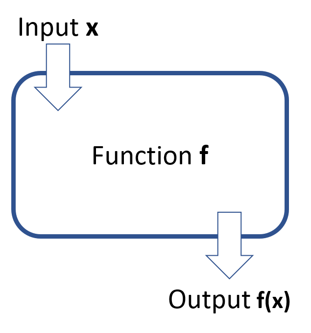
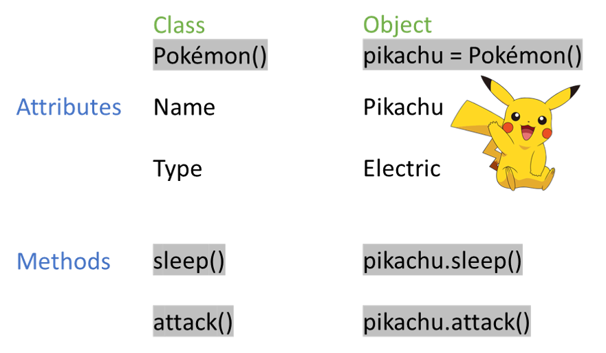
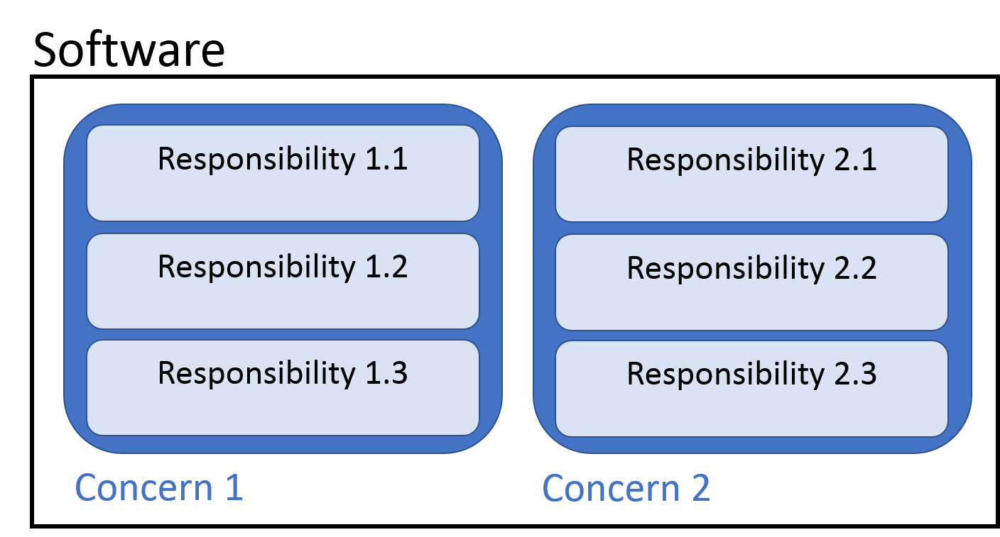

# Core Principles

## Introduction

The principles outlined in this chapter represent good practices in general programming and software development.

Before reading this chapter, you would benefit from having an understanding of basic programming, including awareness of functions and objects (as classes). These topics are lightly introduced, but assume familiarity with core programming techniques.


## Motivation

You can't be available and responsible for long term maintenance of every piece of code that you write; others will inevitably use and likely need to adapt your code in the future.
Therefore, it is important to ensure that other programmers can quickly and easily understand the task that your code performs.
Many programs perform a task correctly, but are deemed to be "black boxes" because of the barrier to understanding them.
It is your responsibility not to put this barrier in place.

This chapter aims to highlight good coding practices that will increase the readability, and therefore maintainability, of your code.


## Modular Code

Breaking your code down into smaller, more manageable chunks is a sure fire way of increasing its readability.

Code comes in many shapes and sizes.
A few code abstractions are outlined below, which will be useful for understanding concepts throughout the rest of this chapter and book.

- Functions
    - a unit of code that performs a minimal number of tasks (one ideally)
    - can take inputs and can return outputs, though both are optional
    - used in functional programming

```{r fig.cap = "Visual representation of a function", out.width = "50%"}

```

- Objects (often defined as classes)
    - can have associated attributes (variables that belong to the object)
    - can have associated methods (functions that belong to the object)
    - maintain association between data (stored in the object's attributes) and a particular set of tasks (the object's methods)
    - the basis of object-orientated programming (OOP)

```{r fig.cap = "Demonstration of a Pokémon class, with an example object (instance of the class)", out.width = "70%"}

```

- Scripts
    - text documents containing source code
    - may be broken down into sections or "chunks"
    - may contain functions, classes and/or lines of non-modular code
- Packages
    - collections of code that perform related tasks
    - may be sub-sectioned into modules that perform related, but lower level groups of tasks
    - contains other useful information about the code in the package (see Packaging)

## Clean Code

Code with high readability is often referred to as "Clean Code".

> "Programs are meant to be read by humans 
>  and only incidentally for computers to execute."
>
> `r tufte::quote_footer('--- Donald Knuth, The Art of Computer Programming')`


### Naming

Perhaps the most important aspect of clean code is the naming of identifiers within your code - including variables, functions and classes.

Someone reading your code will benefit greatly if you use names that are:

- informative and not misleading
- concise but not cryptic

#### Variables

You may have previously come across code that contains variable names that are meaningless, or that infer an incorrect purpose:

```
x = "Sioban"

y = 42

z = Car()

my_favourite_number = "ssh, I'm a string"
```

Another developer, or even yourself in two day's time, would be unable to correctly infer what you intended these variable names to represent.

Using single letters to name variables may be suitable when they are representing well-known mathematical entitites (e.g. y = mx + c), but should otherwise be avoided.

```{r fig.cap = "Gandalf regrets writing poor quality code", out.width = "50%"}
knitr::include_graphics("images/dirty_code_gandalf.png")
```

Using variable names that contain a few (generally 1-3) informative words can drastically improve the readability of your code:

```
# Define variables
first_name = "Sioban"

number_of_attendees = 42

my_car = Car()


# Use variables
print("Hi " + user_name)

number_of_attendees += 1

my_car.clean()
```

Note that the purpose of these variables is clear from their name alone.
Additionally, the variable names make sense in the context that are used later on in the code.
This often removes the need for explanatory comments, as your logic can be intepreted from the code itself.

Naming is also very important for distguishing between similar variables.
It can be tempting to use a incrementing number or character to reflect these differences, however, these identifiers are not informative.

```
letters1 = ["a", "b", "c"]
letters2 = ["x", "y", "z"]
```
Here it is not apparent what makes `letters1` different to `letters2`.

Variable names can instead be used to document differences between variables, or describe changes made to a variable.

```
first_three_letters = ["a", "b", "c"]
last_three_letters = ["x", "y", "z"]

first_three_letters_reversed = reversed(first_three_letters)
```
Here the differences between the two initial lists is clear. It is also clear how the third, new list relates to the first list that was created.

#### Functions

When naming functions, you should consider your user's point of view (even if the user is yourself in the future).
Your user should be able to infer the purpose or action of the function from the name of the function.
If it is not possible to describe the overall task performed by the function in a few words, then it may be that your function is overly complex.
You might consider breaking the function down into a number of smaller functional units.

Where a function performs a specific task, it can be effective to describe this task in the function name, starting with a verb like so:

```
def peel_potato(vegetable):
   if vegetable == "potato":
       return "peeled_potato"
   else:
      raise ValueError("That's not a potato!")
      
prepared_potato = peel_potato("potato")
```

Sometimes a function might be used to provide a Boolean response to a decision.
In this case, it might be appropriate to name a function as a question that is being posed.

```
def is_clean(car):
    if car.cleanliness > 5:
        return True
    else:
        return False

if is_clean(my_car):
    print("Nice!")
```

#### Classes and Objects

Class and object names should be concise and descriptive, like variable names.

```
class SportsCar(Car):

    def clean(self):
        self.cleanliness = 10
        print("Squeak")

    def drive(self):
        print("VROOOOM!")
        
        
my_fast_car = SportsCar()
```

### Code Style

When the syntax of a programming language is not strict (as with python and R), it can be difficult to know how to "correctly" format your code.
Code style guides provide a standard or convention to work towards, with the intention of increase consistency across a programming community.
Following an established or agreed (within a team, for example) style guide will improve your ability to read other peoples code and vice versa.
They might include how to appropriately:
- comment or document your code
- separate elements of your code with whitespace
- follow naming conventions

```{r fig.cap = "Code Quality, from [xkcd](https://xkcd.com/1513/)", out.width = "80%"}
knitr::include_graphics("images/code_quality.png")
```

However, you should not code in fear of breaching style guidance or showing a little flair in your programming style.
Indeed, these guides cannot account for every possibility and may decrease readability of code is some circumstances.
In any case, use your best judgement.

Above all else, you should strive to be **consistent** in your style.
Even if another programmer takes a dislike to your use of whitespace or `mixedCase`, if you use that style consistently throughout your script, project or code in general then they will soon get used to it.

[PEP8](https://www.python.org/dev/peps/pep-0008/) is widely used to style Python code.
While the [Google style guide](https://google.github.io/styleguide/Rguide.html) is often used for R, which expands on the [tidyverse style guide](https://style.tidyverse.org/).


#### Checking Code Style

Manually checking that your code complies with a given style is laborious and arguably a waste of your time - programmers like to automate things after all. Two types of tool exist, which automate validation and repair of code style:
- Linters - these analyse your code to flag sylistic errors (and sometimes bugs or security issues too)
- Formatter - these not only detect when you have diverged from a style, but will automatically correct the formatting of your code

Table: (\#tab:linters) Packages that can be used for linting or formatting in Python and R

| Language | Linters                | Formatters      |
|----------|------------------------|-----------------|
| Python   | flake8, pylint, Bandit | Black, Isort    |
| R        | lintr                  | formatR, styler |

Be sure to read the documentation for any of these tools, to understand what they are checking/changing in your code.
Many of them can be configured to ignore or detect specific types of errors.
There's also nothing to stop you from running multiple of these, to catch a broaded range of stylistic or programmatic errors.

If you're considering using these tools as part of a project, see Continuous Integration for advice on automating the running of these tools.

## Keep It Simple and Straightforward (KISS)

> "Make everything as simple as possible, but not simpler" 
>
> `r tufte::quote_footer('--- Albert Einstein, maybe')`

The KISS principle applies to all forms of communication, including coding.
You are aiming to communicate a complex series of steps to your reader.
Keeping the overall design of your code simple will improve the clarity of this communication.
You'll notice that many principles that support good programming practices share this common theme - **simplicity**.

Simple programs are more likely to run, while any bugs in their code will be easier to track down.

While you should strive towards simplicity, this should not compromise the usability of your code.
It should still perform the desired task, just in a way that is no more complex than necessary.

### Don't Repeat Yourself (DRY)

Repetition not only wastes your time, writing redundant lines of code, but it makes code more difficult to read and maintain.

Consider a script that contains three copies of a similar piece of code.
If the code that is used to perform the repetitive task is found to be incorrect, or if a developer wishes to modify the task being performed by this code, a similar change must be implemented in each of the three copies.

```
first_ten_numbers = list(range(1, 11))

odd_first_ten_numbers = []
for number in first_ten_numbers:
  if number % 2 == 1:
  odd_first_ten_numbers.append(number)

second_ten_numbers = list(range(20, 21))

odd_second_ten_numbers = []
for number in second_ten_numbers:
  if number % 2 == 1:
  odd_second_ten_numbers.append(number)
  
third_ten_numbers = list(range(20, 21))

odd_third_ten_numbers = []
for number in third_ten_numbers:
  if number % 2 == 1:
  odd_third_ten_numbers.append(number)

```

Modifying multiple copies of a code snippet is laborious and presents a risk - some copies of the repeated code may be modified while others erroniously remain the same.
A naive user or developer may assume that all copies of the similar code are performing the same task.
Even if they are aware of the difference, they may be unable to tell if a difference between these copies is intentional or a mistake.

**Refactoring** is the process of restructuring code without changing its behaviour.
For example, converting a few lines of code with a common overall task into a function or class.

If you refactor repetitive code into functions or classes, bug fixes or modifications need only be carried out once to change all implementations.
New, intended behaviour is then consistently reflected by each call to the reusable function or class.
Additionally, the intended functionality can be reflected by the functions name.

```
def get_odd(numbers):
    odd_numbers = []
    for number in first_ten_numbers:
        if number % 2 == 1:
        odd_first_ten_numbers.append(number)
    return odd_numbers


first_ten_numbers = list(range(1, 11))
odd_first_ten_numbers = get_odd(first_ten_numbers)


second_ten_numbers = list(range(20, 21))
odd_second_ten_numbers = get_odd(second_ten_numbers)


third_ten_numbers = list(range(20, 21))
odd_third_ten_numbers = get_odd(third_ten_numbers)
```

If the functionality of `get_odd` needs to be modified, it need only be done once. Additionally, this code is clearer and more concise.


If two slightly different tasks must be carried out, you might:

- develop two functions containing the different elements of code, with names that express the difference in their purpose

or

- add a parameter to your function that will allow a user to differentiate between the two tasks

```
# Simple and modular
def is_odd(number):
    if number % 2 == 1:
        return True
    else:
        return False

def get_odd(list_of_numbers):
    odd_numbers = []
    for number in list_of_numbers:
        if is_odd(number):
            odd_numbers.append(number)
    return odd_numbers

def get_even(list_of_numbers):
    even_numbers = []
    for number in list_of_numbers:
        if not is_odd(number):
            even_numbers.append(number)
    return even_numbers


# More concise, but also more complex - not always good
def get_numbers_with_parity(list_of_numbers, parity):
    numbers_with_parity = []
    if parity == "odd":
        remainder = 1
    elif parity == "even":
        remainder = 0
    else:
        raise ValueError("parity must be 'odd' or 'even'")
    return [number for number in list_of_numbers if number % 2 == remainder]
    
```

You should use your best judgement to decide which is most appropriate in a given situation.

It can be difficult to decide when repetition warrants refactoring of code into reusable functions/classes. The Rule of Three suggests that if similar code has been written more than two times, then it is worth extracting its operation to a reproducible procedure (i.e. a function or class).


### You Ain't Gonna Need It


While you should endeavour to capture your users needs in the functionality that your software provides, going beyond this may not be beneficial.
I can be tempting to try to account for every eventuality in your program, or dive down an interesting 
There's a good chance that many cases that you account for will never occur.

This


### Be Explicit

In the literary sense of the word!

> "Explicit is better than implicit"
>
> `r tufte::quote_footer('--- The Zen of Python (import this)')`

In some programming languages, it is possible to perform a task or decision by relying on an implied parsing of your code.

To make your intentions clear, you should explicitly state yout intentions in the code.


```
coconut_count = None

# Relying on falseness of None
if coconut_count:
    print("There are " + coconut_count + " coconuts!")

```

In the example above, the coconut count is not printed because None is evaluated to False.
In python and R, 0 will also evaluate to False.
It is unclear whether the programmer intended that the statement is printed when the count is 0.
If a count of 0 should be printed, then this lack of specificity has created a bug.

To perform the same decision explicitly, you could specify the exact condition under which the coconut count should be printed.

```
coconut_count = 0

# Explicitly only print if not None
if coconut_count is not None:
    print("There are " + coconut_count + " coconuts!")
```

## SOLID Software Design

SOLID is an acronym that encompasses 5 software design principles that are intended to increase the readability and extensibility of software source code.
These principles are designed to improve object-orientated programs, but can be roughly applied to functional programs.


### Single responsibility

> An object should have a single responsibility.
> Only changes to one part of the software's specification should be able to affect the specification of the class.

This principle suggests that a single element of your code (a function or class) should be responsible for a single part of your software's funcitonality.
It should take on one taks and perform it well.

A piece of code is more robust if there are fewer reasons to change it in the future.
Code that is responsible for multiple aspects of your softwares functionality might need modifying for several reasons.
Because of this multitasking design, it is also likely to be more difficult to modify this code without having an unintentional effect on other aspects of the software.

Applying this principle reduces the complexity of your code, as the task assigned to each function or class is clearly defined and is independent of other functions or classes.
This simplicity also increases usability, by minising the number of parameters that each function or class might require.

The Separation of Concerns priciple captures a similar concept to Single Responsibility, but on a higher level.
This principle suggests that your software should be separated into distinct sections that each address a single concern.

For example, if your software is responsible for managing sales of a product, then your concerns might include:

- Presenting information to the customer, to allow them to select a product
- Taking payment from the customer
- Arranging dispatch and delivery of the product

Within the section of you software that is responsible for taking payment, you might have multiple responsibilities:

- collect the users input, to capture payment details
- pass the payment information on to a third party, to process the payment
- report the status of the payment to the user

```{r fig.cap = "Representation of concerns and responsibilities within a piece of software", out.width = "80%"}

```


As such, separate sections of your software should be responsible for each of the concerns.
Within each section of your software, disctinct functions or classes should be responsible for each task that is required for that sections overall functionality.

### Open-closed

> Objects and functions should be open for extension, but closed for modification

This means that it should be possible to extend the functionality of classes or functions, without modifying their source code.
For example, extension of a class or function could be carried out through subclassing or wrapper functions/decorators, respectively.

### Liskov substitution

> Objects should be replaceable with instances of their subtypes, without altering the correctness of that program

Subclasses should not damage the functionality of their parent class in their implementation.
They should extend their usefulness, but retain their original functionality.

### Interface segregation

> Many client-specific interfaces are better than one general-purpose interface

As you add more and more functionality into a single interface, it becomes more difficult to extend or maintain. Separating these into multiple interfaces increases simplicity and maintainability.

### Dependency inversion

> Depend on abstractions, not concretions

High level modules should not depend on low-level modules. Both should depend on interfaces - i.e. be built with this interaction in mind.
Abstractions should not depend on specific details. Concrete implementations should depend on abstractions.
