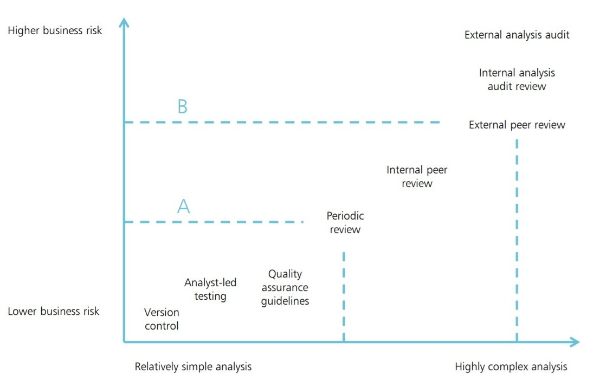

# Modeling

This figure the principle that as models become increase in business risk and complexity the level of appropriate QA increases. This is similar to the principles of RAP levels explored in the next chapter.

## AQUA book QA principles for code

The principles of QA from the AQUA book apply to models whether they are in excel or open sources languages such as R or python. The difference is that new software practices can allow analysts to enhance the QA of models easier and more efficient whilst adding new features. Version control can be achieved through using [GIT]. Git also makes the process of peer review easier and more efficient. It is also easy using Git to push the code used to produce models to external platforms such as GitHub allowing the model code to be publicity available. This enhancing the transparency of government and would allow analysts or informed citizens to contribute by finding error or bugs or suggesting new approaches. This is also a powerful tool for spreading best practice as analysts would be able to look at effective models from across government rather than keep them siloed in departments.

Git offers an platform for effective peer review whether from others in the team but also from analysts in other teams or departments. Making peer review easier to preform is an effective tool for increasing overall QA. Git also tracks changes made to code and who made them, and includes the decisions behind the changes. This ensures that models have a full audit trail built in without analysts having to invest resources documenting it.

Ensuring that a model is producing the correct output is a time intensive process of analytical testing. This process can be automated using software [Testing] frameworks. This enhances the robustness of models and increases confidence that the output is a result of the data not the process.   

## Repeatable

The [AQUA Book](https://assets.publishing.service.gov.uk/government/uploads/system/uploads/attachment_data/file/416478/aqua_book_final_web.pdf) states that analysis should be repeatable to be considered valid. Using open source languages increases the repeatable of analysis over spreadsheets such as excel which often require many manual steps which can be hard to repeat. Using scripted languages means that the entire process has been written down and can be exactly repeated. Using languages such as SPSS or SAS suffer from repeatable because they are propriety software languages which means a license is needed to use them, which may not always be the case.   

## RAP Levels align with AQUA Levels
**work in progess**
