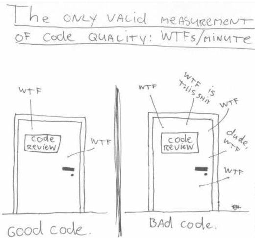

# Coding Guidelines {#Coding_Guidelines}

Best practices are more about what code you write than how you write it.
For example, there are many ways to access databases, but one particular way might be considered ‘best practice’
so that everyone in a team knows how it works and doesn't have to learn other methods.

> Good coding style is like correct punctuation: you can manage without it, butitsuremakesthingseasiertoread.
– **The Tidyverse Style Guide by Hadley Wickham**

## Why Useful

Coding guidelines are helpful

* Peer Review
* Makes it easier to learn
  - Often people new to coding want some guidelines as this makes it easier to learn. It is hard to know what is best practice, so some guidelines can be helpful.
* Makes maintaining code easier
  - Just as important as writing the code is maintaining it in production, perhaps after the writers have left.  Maintainability is always an important consideration to make projects sustainable.
* Makes projects more coherent
  - If code is written by a team then if everyone is writing in unique distinct styles then the project
  will be much harder to read when combined.

## Best Practice: Coding Principles

Specific and prescription coding guidelines ensure that all the code follows a similar style but can be difficult to implement. However there are some principles which apply to all languages and can be used to improve the quality of your code.

1. Naming
  -  The names of variables & functions need to be descriptive (intention-revealing), pronounceable and need to reflect what a function does and what the variables are.
2. Short vs Readability
  - Being efficient with writing does not always lead to a code that is readable, don't sacrifice readability to make your code shorter.
3. Distinct (Ubiquitous language)
  - Make meaningful distinctions. Do not use the same name for two (or more) distinct items. Use the same term in the code, in the documents and when talking to users.
  - eg Do not use  cancer name for the Data and the model. Use cancerData and cancerModel for the Data and model respectively. The same is true for Dataframes and columns of the Dataframes.
4. Code can be self-documenting.
  - Put the effort to improve, organize and structure your code i.e. clean it.
5. Keep functions simple
  - Keep as few arguments as possible when creating a function. A function should aim to do one thing well, if there are lots of arguments then maybe that is a sign you should think about separating the function into multiple functions. The idea it to keep the code together that can get damaged for the same reason of change, when changing something you want to impact as few things as possible.  
6. Nesting.
  - You should always avoid nesting as it make the code harder to read and understand.

## Style Guides
There are many style guides out there. You may choose to adopt one or part of one. Your team or department could also write some guidelines tailored to your needs to encourage best practice.
Here are some existing guidelines:

* [Best Practice in Programming for Data Scientists:](https://datasciencecampus.github.io/coffee-and-coding/20190611_clean_code/Best_Practice_in_Programming_for_Data_Scientists_python_and_R.html#2_names)

* [Google’s R Style Guide](https://google.github.io/styleguide/Rguide.xml)

* [TidyVerse Style Guide](https://style.tidyverse.org/)

* [The State of Naming Conventions in R](https://journal.r-project.org/archive/2012-2/RJournal_2012-2_Baaaath.pdf)

* [PEP 8 -- Style Guide for Python Code](https://www.python.org/dev/peps/pep-0008/)

* [Ministry of Justice Analytical Services Coding Standards](https://github.com/moj-analytical-services/our-coding-standards)

* [Data Science Campus Coding Standards](https://datasciencecampus.github.io/coding-standards/)

* [Health and Social Care Scotland R Resources](https://github.com/Health-SocialCare-Scotland/R-Resources/blob/master/PHI%20R%20style%20guide.md)
