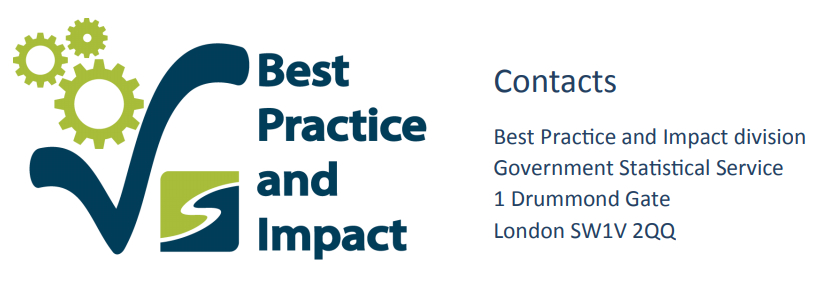

# Preface {-}

**ALPHA**

This is a draft of GSS guidance. This is unpublished and **does not** represent the views of the **ONS** or the **GSS**.

* Twitter: [GSSGoodPractice](https://twitter.com/gssgoodpractice), [UKGSS](https://twitter.com/ukgss)
* Email us: gsshelp@statistics.gov.uk

# Introduction

This guidance is published as part of the Quality guidance published by the Best Practice and Impact team in the Office for National Statistics. This guidance has been created to support the analytical professions in government who are using coding languages for various forms of analysis such as the production of statistics or modeling.

## Who is this guidance for?

This guidance is for analysis's who are using or want to use new methods and techniques to improve and ensure that they use best practice in their work. The aim of this guidance is to promote good practice in coding across the government analytical professions, it is not targeted for data scientists but more for analysts who use code but have not been formally trained in computer science.  

The guidance is an introduction to techniques and methods, not a comprehensive learning resource. However, it is also not an introduction to coding. You are likely to get the most from this guidance if you are familiar with coding principles, have used a script based language before, or currently use R or Python for analysis. At the end of chapters there are links to resources which provide a more comprehensive and in-depth guide to the methods. These are not the only learning resources available, but we have tried to link to ones that are used widely.

## What is its aim?

Analysis in government is moving away from legacy systems that are largely manual to workflows built using open source languages and tools that encourage rigorous documentation and a full audit trail. This trend, which builds on best practice in software engineering, provides opportunities for using new tools and methods to enhance the quality of the systems used to produce statistics. Many producers of such systems are not data scientists or coding experts, but other analysts or non-analytical staff who may not be familiar with these new approaches. This guidance aims to introduce some of the common practices that are recommended for implementing analysis in a transparent and fully auditable way and sources best practice from across government.

## Why the move away from Spreadsheets

Many departments are moving some analysis from spreadsheets to open source languages like R and python. This is due to a few reasons.

* Spreadsheet errors
  - Fundamentally spreadsheets intermesh data and code together. This makes it more difficult to QA and test the logic as it is mixed up in the data and it is harder to understand what the code is doing. Splitting the code and data allows tests to be written with many data types. Spreadsheets are not designed to work with best practice software testing.   
  - These are relatively common due to human error. a [list of errors](http://www.eusprig.org/horror-stories.htm) caused by spreadsheets illustrates this. This is related to the high degree of copy and pasting that spreadsheets encourages and the intermeshing of data and logic together. It is [estimated](https://genomebiology.biomedcentral.com/articles/10.1186/s13059-016-1044-7) that 20% of genetic research papers contains errors because excel converted gene names into calendar dates. This demonstrates the difficulty of spreadsheet logic preforming tasks without informing the user, which combined with the difficulty of testing causes errors resulting in the need for large amounts of time intensive manual QA.  
* Lack of Proper Version Control
  - Whilst it is possible to version control spreadsheets it is difficult and time consuming relative to new tools available such as Git. This allows not only a complete record of every change but the reasons and decisions behind the process are also stored. This provides an audit trail and allows manager to have confidence in the QA of the analysis without having to go through the work line by line.
  - It is very difficult using Git to make changes without it being recorded which along with it's ease of use makes VC a fundamental part of the analytical workflow rather than relying on the burden placed on the analysis to remember to recorded changes and maintain proper VC.
* Less reproducible.
  - Spreadsheets often involve many manual steps or 'point and clicks'. These steps are not recorded and make reproducing work later difficult or impossible. Notes or documentation may help in this process but even detailed documentation is unlikely to give a full record of the process.
* Testing and QA often happens at the end, not throughout
  - QA is a time consuming process when done manually and can take up a significant proportion of an analysts time. Automating QA and other aspects free up time to be spent querying the process and interpreting the results.

## Why move from SAS or SPSS to open source
**expand**
* black box- can't examine the algorithms
* hard to do Testing
* more limited
* cost money

## Open source

Open source languages such as Python and R are increasing in popularity across government. One advantage of using these tools is that we can reduce the number of steps where the data needs to be moved from one program (or format) into another. This is in line with the principle of reproducibility given in guidance on producing quality analysis for government (the AQUA book), as the entire process can be represented as a single step in code, greatly reducing the likelihood of manual transcription errors.

The [Technology Code of Practice](https://www.gov.uk/government/publications/technology-code-of-practice/technology-code-of-practice) is a set of criteria to help government design, build and buy technology. It’s used as a cross-government agreed standard in the spend controls process. Criteria 3 *"Be open and use open source"* recommends using open sources languages such as R or Python.

Open source languages are easier to find learning material and guides for as there are large and vibrant communities producing materials. This allows a large  degree of self learning, if a output/method/technique wants to be implemented there is very likely a library to support it and a guide to teach it available for all. Also as a result of the large communities of users these languages are capable of preforming a diverse array of tasks allowing departments to try innovative new approaches such as interactive dashboards or web scraping. Which language analysts or departments choose will depend on the particular needs of the area. In general R and Python are the most popular and are good at similar  [tasks](https://www.openriskmanual.org/wiki/Python_versus_R_Language)

## For Managers

Managers or analysts responsible for producing analysis such as statistics and modelling are responsible for showing that the outputs are fit for purpose and have been properly Quality Assured. Whilst spreadsheet based workflows are familiar to all, these new approaches require changes to the process which may leave managers unsure of the robustness of the process. This may lead to an issue where these processes are slowed down or not deployed due to these worries or the manager feels the responsibility to go line by line through the process. This guidance will show how managers can be certain that best practice has been followed. If the process follows these best practices then a manager can have confidence in the output. Managers can ask whether business risk they sit on has been properly tested and uses VC, and can see every change and how the changes where managed using Git allowing the analysists to focus on the coding and the managers to focus on managing.
